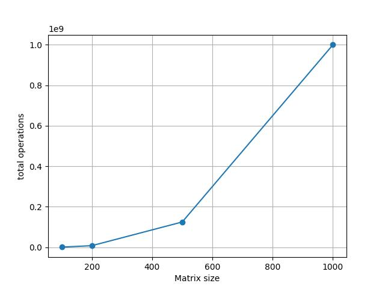
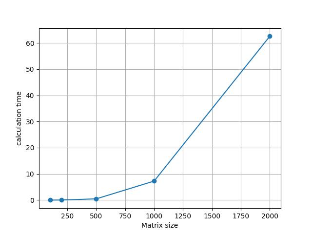

# Отчёт по Лаб.1

### Выполнил:
Ганеев Тимур Айдарович\
гр. 6212

## Задание
- Написать программу на языке C++
для перемножения двух квадратных матриц
- Проверить корректность вычислений
- Исследовать программу при разных размерах матриц

## Результаты
При перемножении матриц размерами 100, 200, 500, 100
и 2000, было выявлено, что зависимости времени и
числа оперций операций от размера матриц - кубические:

Это объясняется сложностью алгоритма O(N^3)
