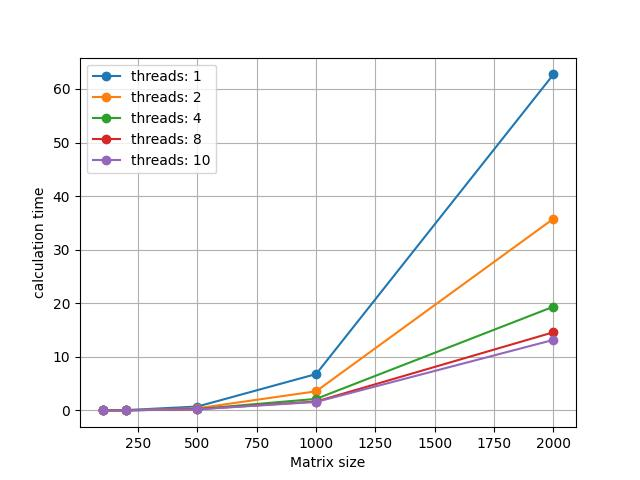

# Отчёт по Лаб.2

### Выполнил:
Ганеев Тимур Айдарович\
гр. 6212

## Задание
- Модифицировать программу из л/р №1 для параллельной работы по технологии OpenMP
- Проверить корректность вычислений
- Исследовать программу при разных размерах матриц, количестве потоков

## Результаты
Параллельная работа программы позволила сильно ускорить процесс вычисления.
Однако увеличение скорости было заметно только при больших размерах матриц (1000, 2000),
и с увеличением числа потоков эффект постепенно спадал:
- Разница между вычислением с одним потоком (без параллельной работы) и с двумя - примерно 44%
  (от 62 с. до 35 с. при размере матриц 2000)
- между вычислением с 2 потоками и с 4 - примерно 45% (от 35 с. до 19 с. при размере матриц 2000)
- между вычислением с 4 потоками и с 8 - примерно 26% (от 19 с. до 14 с. при размере матриц 2000)

