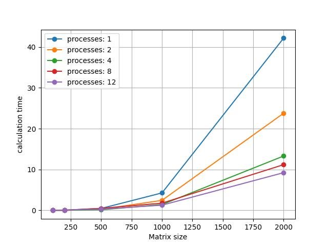

# Отчёт по Лаб.3

### Выполнил:
Ганеев Тимур Айдарович\
гр. 6212

## Задание
- Модифицировать программу из л/р №1 для параллельной работы по технологии MPI
- Проверить корректность вычислений
- Исследовать программу при разных размерах матриц, количестве ядер

## Результаты
### Среднее время вычисления при различном числе ядер
|    |  100   |  200   |  500   |  1000  |  2000   |
|----|:------:|:------:|:------:|:------:|:-------:|
| 1  | 0.0096 | 0.0318 | 0.4744 | 4.2778 | 42.1808 |
| 2  | 0.0100 | 0.0224 | 0.2628 | 2.4556 | 23.7878 |
| 4  | 0.0190 | 0.0252 | 0.1464 | 1.4252 | 13.3108 |
| 8  | 0.0220 | 0.0440 | 0.4950 | 1.7652 | 11.2003 |
| 12 | 0.0198 | 0.0984 | 0.2976 | 1.2726 | 9.2338  |

- Параллельная работа программы позволила сильно ускорить процесс вычисления
по сравнению с линейной работой программы и с OpenMP
- Увеличение скорости было существенно только при больших размерах матриц (1000, 2000)
- При малых размерах матриц увеличение числа ядер могло немного замедлить вычисления
- С увеличением числа ядер эффект ускорения постепенно падал
- С увеличением числа ядер разброс по времени вычисления между одинаковыми
опытами рос

