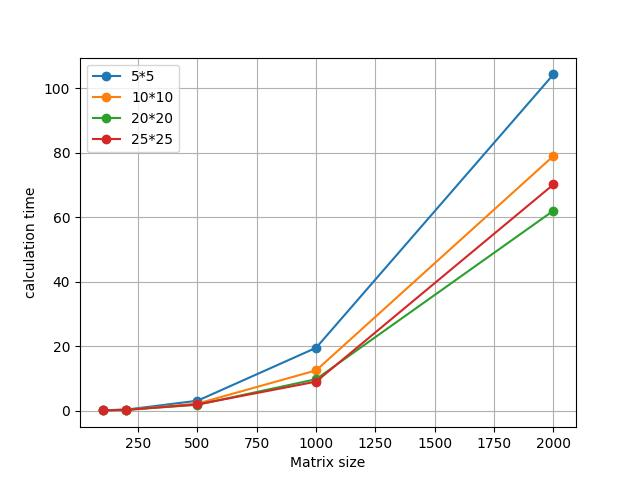
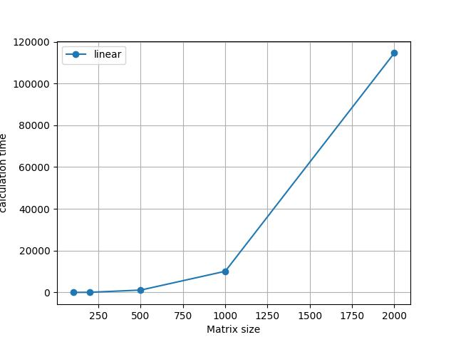

# Отчёт по Лаб.4

### Выполнил:
Ганеев Тимур Айдарович\
гр. 6212

## Задание
- Модифицировать программу из л/р №1 для параллельной работы по технологии CUDA
- Проверить корректность вычислений
- Исследовать программу при разных размерах матриц, конфигурациях блоков

## Результаты
### Среднее время вычисления при различных размерах блоков (мс)
|       |  100   |  200   |  500   |  1000  |  2000   |
|:-----:|:------:|:------:|:------:|:------:|:-------:|
|  Лин  | 7.5532 | 76.432 | 1122.3 | 10119  | 114587  |
|  5*5  | 0.1244 | 0.3384 | 3.0955 | 19.519 | 104.324 |
| 10*10 | 0.1652 | 0.2824 | 2.2138 | 12.504 | 79.0302 |
| 20*20 | 0.1221 | 0.2790 | 1.8408 | 9.7780 | 62.0561 |
| 25*25 | 0.0948 | 0.2465 | 1.9585 | 9.0185 | 70.1833 |
- Параллельная работа программы с помощью CUDA позволила на несколько порядков сократить время вычисления
по сравнению с линейной работой или с другими изученными технологиями параллельных вычислений
- Увеличение скорости было существенно при любых размерах матриц
- Разница по времени при разных конфигурациях блоков невелика, хотя и заметна

### Сравнение времени вычислений при различных конфигураций блоков (мс)

### График времени вычислений при линейной работе (мс)

