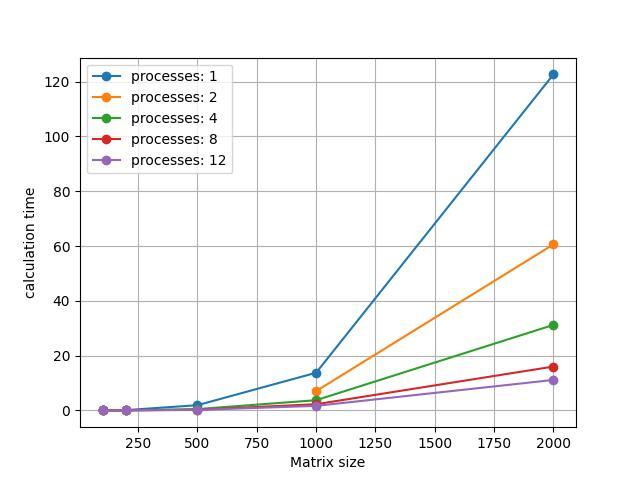

# Отчёт по Лаб.5

### Выполнил:
Ганеев Тимур Айдарович\
гр. 6212

## Задание
- Запустить программу из л/р №3 на суперкомпьютере «Сергей Королёв»

## Результаты
### Среднее время вычисления различным числом ядер
|    |  100  |  200  |  500  |  1000  |  2000   |
|----|:-----:|:-----:|:-----:|:------:|:-------:|
| 1  | 0.022 | 0.122 | 1.914 | 13.750 | 122.632 |
| 2  | 0.012 | 0.067 |       | 7.046  | 60.600  |
| 4  | 0.012 | 0.034 | 0.486 | 3.736  | 31.204  |
| 8  | 0.012 | 0.020 | 0.258 | 2.264  | 16.010  |
| 12 | 0.010 | 0.022 | 0.192 | 1.662  | 11.132  |

- Так же, как и на ПК, работа программы с MPI на суперкомпьютере была значительно
быстрее по сравнению с линейной
- Увеличение числа ядер снижало время вычислений при любых размерах матриц

